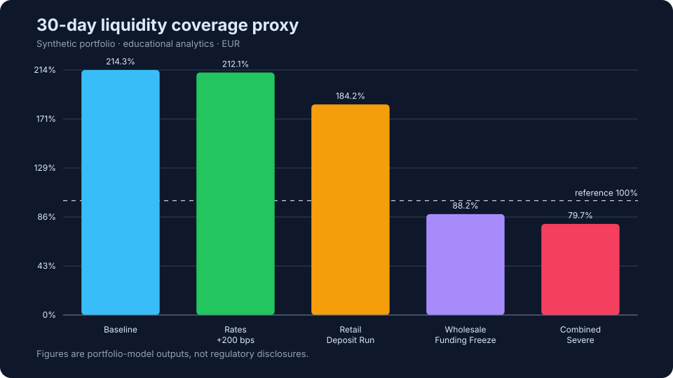
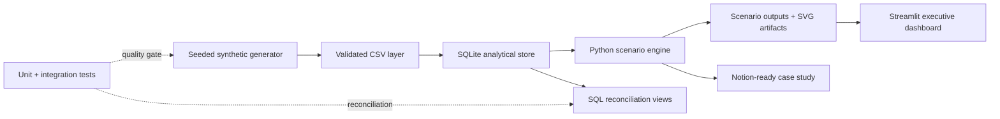
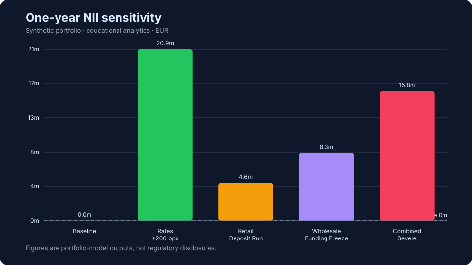

# Treasury Liquidity & Interest-Rate Stress Lab


An end-to-end banking analytics project that turns a **deterministic synthetic balance sheet** into treasury decision support: 30-day liquidity coverage, stressed cash-flow gaps, and one-year net interest income (NII) sensitivity. It demonstrates how I translate a risk question into a reproducible data product spanning Python, SQL, data controls, visualization, testing, and executive communication.

> **Scope boundary:** This is an educational portfolio model, not regulatory LCR, IRRBB, ILAAP, ALM, risk appetite, or financial reporting. All data is synthetic; no bank, account, or customer data is used.

## Executive result

The synthetic portfolio remains comfortably above the illustrative 100% coverage reference in baseline, but its dependence on short-dated wholesale funding becomes visible under stress:

| Scenario | Eligible buffer | Net 30-day outflows | LCR-style proxy | Liquidity surplus / (shortfall) | Δ one-year NII |
|---|---:|---:|---:|---:|---:|
| Baseline | €491.0m | €229.1m | **214.4%** | €261.9m | €0.0m |
| Retail Deposit Run | €480.8m | €261.0m | **184.2%** | €219.8m | €4.6m |
| Wholesale Funding Freeze | €465.5m | €527.5m | **88.2%** | **(€62.0m)** | €8.3m |
| Rates +200 bps | €485.9m | €229.1m | **212.1%** | €256.8m | €20.9m |
| Combined Severe | €429.8m | €539.6m | **79.7%** | **(€109.8m)** | €15.8m |

The binding Combined Severe scenario falls below the illustrative reference and creates a €109.8m modelled liquidity shortfall. The positive NII response to rising rates does not offset the liquidity vulnerability—a useful example of why treasury decisions should consider funding resilience and earnings together.



## Business questions

1. Does the liquid-asset buffer cover modelled net cash outflows over 30 days?
2. Which runoff, inflow, haircut, and rate assumptions make the portfolio most vulnerable?
3. Where do stressed contractual and behavioural cash-flow gaps appear by tenor?
4. How does a parallel rate shock affect one-year NII given repricing timing and pass-through?
5. What actions would a treasury or ALCO audience consider from the combined liquidity and earnings view?

## What I built



- **Data generation:** 900 seeded position-level records across assets, deposits, and wholesale funding, plus 72 illustrative EUR rate observations.
- **ETL and modelling:** schema-constrained SQLite tables, indexes, quality checks, analytical views, and persisted result tables.
- **Scenario analytics:** five transparent stress cases covering runoff, inflow timing, HQLA haircuts, and parallel rate shocks.
- **Decision metrics:** 30-day LCR-style proxy, eligible buffer, capped inflows, liquidity surplus/shortfall, survival-days proxy, tenor gaps, and NII change.
- **Delivery:** interactive Streamlit dashboard, version-controlled SVG charts, executive summary, data dictionary, methodology, limitations, tests, and CI.

## Dashboard

The dashboard includes an executive scenario selector, liquidity bridge, cash-flow ladder, NII comparison, balance-sheet composition, market-rate context, and embedded method controls.

```bash
python3 -m venv .venv
source .venv/bin/activate           # Windows: .venv\Scripts\activate
pip install -r requirements.txt
make all
make dashboard
```

Streamlit opens at `http://localhost:8501`. The core pipeline itself uses only the Python standard library; pandas, Plotly, and Streamlit are dashboard dependencies.

## Reproduce the analysis

```bash
# Complete generation → ETL → analysis → charts
make all

# Run 11 unit/integration tests
make test

# Test and validate Python syntax
make check
```

Or run each stage explicitly:

```bash
PYTHONPATH=src python -m liquidity_stress.generate --seed 20260902 --positions 900
PYTHONPATH=src python -m liquidity_stress.database
PYTHONPATH=src python -m liquidity_stress.pipeline
```

Re-running with the default seed produces the same inputs and results. Change `--seed` to create a different synthetic bank profile without changing the model logic.

## Analytical method at a glance

### 30-day coverage proxy

```text
Eligible buffer = Σ unencumbered HQLA × (base factor − scenario haircut add-on)
Recognised inflows = min(stressed inflows, 75% × stressed outflows)
Net outflows = stressed outflows − recognised inflows
LCR-style proxy = eligible buffer / net outflows × 100
```

The calculation borrows the broad structure of LCR for educational analysis, but intentionally excludes many regulatory classifications, caps, and jurisdiction-specific rules. See [methodology](docs/methodology.md) and [limitations](docs/limitations.md).

### Cash-flow gap

Principal inflows and outflows are stressed and allocated to `0–7`, `8–30`, `31–90`, `91–180`, `181–365`, and `>365 day` buckets. The dashboard shows both the raw cumulative gap and the cumulative position after adding the scenario-adjusted liquid-asset buffer.

### One-year NII sensitivity

Rate-sensitive balances are weighted by time remaining after their next repricing date. Asset and liability shocks use separate scenario betas, providing a transparent directional estimate rather than a full IRRBB or dynamic-balance-sheet model.



## Repository map

```text
├── app.py                         # Streamlit executive dashboard
├── config/scenarios.json          # Versioned stress assumptions
├── data/raw/                      # Generated synthetic inputs + lineage metadata
├── docs/
│   ├── architecture.md
│   ├── data_dictionary.md
│   ├── methodology.md
│   ├── limitations.md
│   ├── notion_case_study.md
│   └── recruiter_talking_points.md
├── sql/
│   ├── 01_schema.sql              # Tables, constraints, indexes, views
│   ├── 02_quality_checks.sql       # Reusable data-quality checks
│   └── 03_scenario_analysis.sql    # Analyst-facing scenario queries
├── src/liquidity_stress/          # Generator, ETL, model, pipeline, SVG charts
├── tests/                         # Determinism, calculations, controls, reconciliation
├── outputs/                       # CSV results and executive summary
├── artifacts/                     # GitHub-renderable analytical charts
└── .github/workflows/ci.yml       # Automated test and build gate
```

## Data and model controls

- Generation metadata explicitly records the seed, row counts, as-of date, and synthetic-data flag.
- Primary keys, `CHECK` constraints, foreign keys, and range checks protect the SQLite layer.
- Encumbered assets cannot contribute to the eligible buffer.
- Recognised 30-day inflows are capped at 75% of outflows.
- Independent SQL views reconcile the Python coverage calculation to two decimal places.
- Integration tests build the database from scratch and validate all 5 scenarios and 30 tenor rows.
- GitHub Actions repeats tests, the full analysis build, syntax validation, and artifact upload.

## Management recommendations from the case

1. **Reduce short-dated wholesale concentration.** The wholesale freeze is the first scenario to cross below the illustrative coverage line.
2. **Pre-fund the severe shortfall.** A €109.8m modelled gap suggests a concrete contingency-funding target plus execution buffer.
3. **Protect Level 1 availability.** Preserve unencumbered collateral and monitor haircut sensitivity, not just nominal securities balances.
4. **Use joint liquidity/earnings limits.** Positive rate-driven NII should not be treated as compensation for weaker funding resilience.
5. **Extend the model before production use.** Add behavioural calibration, currency-specific ladders, secured funding, derivatives, and governance-approved regulatory mappings.

## Documentation

- [Architecture and lineage](docs/architecture.md)
- [Data dictionary](docs/data_dictionary.md)
- [Calculation methodology](docs/methodology.md)
- [Limitations and production roadmap](docs/limitations.md)
- [Notion-ready case study](docs/notion_case_study.md)
- [Recruiter and interview talking points](docs/recruiter_talking_points.md)

## License

MIT — see [LICENSE](LICENSE).

