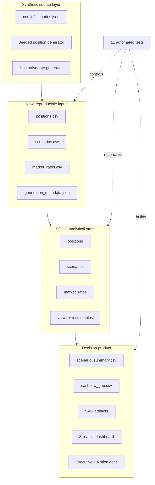

# Architecture, lineage, and control design

## System context

This project is deliberately small enough to run locally while preserving the layers expected in an analytical data product: source, validation, storage, transformation, presentation, and quality assurance.

## Components

| Component | Responsibility | Key control |
|---|---|---|
| `generate.py` | Create deterministic positions and rate observations | Fixed seed; explicit synthetic-data metadata |
| `database.py` | Validate columns and load SQLite | Required-field checks; transactional load; database constraints |
| `01_schema.sql` | Define tables, indexes, and analytical views | Primary/foreign keys; range and enumeration checks |
| `analysis.py` | Calculate buffer, outflow, tenor-gap, and NII metrics | Small pure functions tested independently |
| `pipeline.py` | Orchestrate scenario calculations and persist results | Empty-store guard; atomic result replacement |
| `charts.py` | Render version-controlled SVG artifacts | No binary or plotting dependency in core pipeline |
| `app.py` | Present scenario exploration to decision makers | Generated-output check; visible scope disclaimer |
| GitHub Actions | Repeat the build on every change | Fresh environment, tests, build, syntax check, artifact upload |

## Data lineage

1. `config/scenarios.json` is the controlled source for scenario assumptions.
2. `generate_dataset()` materializes input CSVs and a generation manifest.
3. `build_database()` validates headers and writes to constrained SQLite tables within a transaction.
4. The Python engine reads only those governed tables, applies versioned assumptions, and persists calculation outputs.
5. SQLite view `v_scenario_lcr_proxy` independently expresses the coverage calculation for reconciliation.
6. CSVs and SVGs are generated from the same in-memory result set; the Streamlit application reads those outputs.

## Why SQLite

SQLite makes the case study portable while still demonstrating relational modelling, integrity constraints, indexes, SQL views, window functions, and analyst queries. In production, the storage interface could move to PostgreSQL, Snowflake, BigQuery, or a lakehouse without changing the calculation contracts.

## Auditability and reproducibility

- The default seed is `20260902`; the as-of date is `2026-06-30`.
- Scenario assumptions are data, not hard-coded branches.
- Output row counts are written to `analysis_manifest.json`.
- The ignored `.db` file can always be rebuilt from tracked CSV/config/code.
- Both component-level and integration tests run without network access.
- Analytical artifacts include an explicit synthetic/non-regulatory label.

## Production adaptation

A production implementation would add source-system contracts, orchestration, immutable partitions, identity/access controls, observability, data-quality thresholds, model approvals, assumption versioning, back-testing, maker-checker workflow, and deployment separation between development and regulatory environments.

