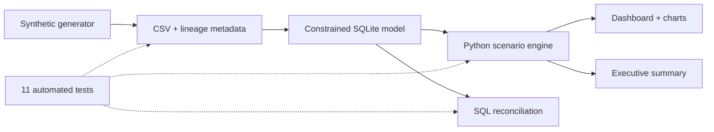

# 🏦 Treasury Liquidity & Interest-Rate Stress Lab

> **Portfolio case study · Banking / Finance · Data Analytics**  
> Python · SQL · SQLite · Streamlit · Plotly · GitHub Actions  
> Status: Complete | Data: 100% synthetic | As of: 30 June 2026

---

## TL;DR

I built an end-to-end treasury analytics product that converts 900 synthetic balance-sheet positions into scenario-based liquidity and earnings insights. The model tests five scenarios, calculates a simplified 30-day coverage proxy, creates tenor cash-flow gaps, estimates one-year NII sensitivity, and delivers results through an interactive dashboard and controlled SQL/Python pipeline.

**Key finding:** baseline coverage is 214.4%, but a wholesale funding freeze reduces it to 88.2% and Combined Severe to 79.7%, producing a €109.8m modelled liquidity shortfall. Rising rates improve modelled NII, but that earnings benefit does not solve the funding vulnerability.

> ⚠️ Educational portfolio model only—not regulatory LCR, IRRBB, ILAAP, ALM, risk appetite, or financial reporting.

## The business problem

A treasury/ALCO team needs to understand more than the nominal value of liquid assets. It needs to know whether the buffer remains available after haircuts, how deposit and wholesale runoff changes 30-day outflows, where tenor gaps accumulate, and whether the rate environment changes earnings in the same scenarios.

I framed the project around five questions:

1. Can the available liquidity buffer cover stressed 30-day net outflows?
2. Is retail or wholesale funding stress more binding?
3. Which maturity buckets create the largest cumulative gap?
4. How does repricing asymmetry change one-year NII?
5. What decisions should treasury prioritize from the combined view?

## My role

I designed and implemented the complete analytics lifecycle:

- Defined business questions, KPIs, scenario narratives, and analytical boundaries.
- Built a deterministic synthetic data generator with explicit lineage metadata.
- Modelled constrained SQLite tables, indexes, quality checks, and reconciliation views.
- Implemented transparent Python calculations for buffer eligibility, outflow/inflow stress, cash-flow gaps, and NII sensitivity.
- Created an interactive Streamlit dashboard and version-controlled SVG artifacts.
- Wrote unit/integration tests and a GitHub Actions quality gate.
- Translated the results into an executive narrative, recommendations, limitations, and production roadmap.

## Dataset

| Dataset | Grain | Volume | Purpose |
|---|---|---:|---|
| Positions | One synthetic balance-sheet position | 900 | Liquidity, maturity, repricing, product, segment, currency |
| Scenarios | One controlled stress case | 5 | Runoff, inflow, haircut, rate shock, pass-through assumptions |
| Market rates | One illustrative series/month | 72 | Dashboard context across 24 month-ends |

No PII, account identifiers, confidential bank values, or externally scraped data is present. The seed (`20260902`) reproduces the entire portfolio.

## Solution architecture

## Scenario design

| Scenario | Core narrative |
|---|---|
| Baseline | Business-as-usual runoff, inflow, haircut, and no rate shock |
| Retail Deposit Run | 2.5× retail runoff with mild spill-over and delayed inflows |
| Wholesale Funding Freeze | 3× non-retail runoff with weaker inflows and higher buffer haircut |
| Rates +200 bps | Isolates asset/liability repricing and pass-through asymmetry |
| Combined Severe | Joint retail/wholesale stress, 70% inflow recognition, 12 pp extra haircut, +250 bps |

## KPI definitions

**Coverage proxy** = scenario-adjusted unencumbered liquid-asset buffer ÷ modelled net 30-day outflows.

**Net outflows** = stressed gross outflows − min(stressed inflows, 75% of outflows).

**Liquidity surplus/shortfall** = eligible buffer − net outflows.

**ΔNII** = sum of asset and liability repricing impacts within one year using scenario-specific pass-through betas.

## Results

| Scenario | Coverage | Surplus / (shortfall) | Survival proxy | ΔNII |
|---|---:|---:|---:|---:|
| Baseline | 214.4% | €261.9m | 64.3 days | €0.0m |
| Retail Deposit Run | 184.2% | €219.8m | 55.3 days | €4.6m |
| Wholesale Funding Freeze | 88.2% | (€62.0m) | 26.5 days | €8.3m |
| Rates +200 bps | 212.1% | €256.8m | 63.6 days | €20.9m |
| Combined Severe | 79.7% | (€109.8m) | 23.9 days | €15.8m |

### Insight 1 — wholesale stress is the binding standalone risk

Retail runoff reduces coverage by 30.2 percentage points but remains above the reference. Wholesale stress more than doubles net outflows and creates a €62.0m shortfall. The result points to maturity concentration and renewal dependence, not just deposit stability.

### Insight 2 — buffer quality matters as much as buffer size

Combined Severe reduces the available buffer from €491.0m to €429.8m through additional haircuts while outflows rise. Monitoring nominal securities alone would overstate usable liquidity.

### Insight 3 — earnings and liquidity tell different stories

The +200 bps scenario adds €20.9m of modelled one-year NII because assets reprice faster/more strongly than liabilities in the simplified portfolio. Yet Combined Severe still fails the liquidity reference despite positive ΔNII. Treasury needs joint limits, not isolated optimization.

## Recommendations

1. Diversify and term out wholesale funding before the severe scenario horizon.
2. Set a contingency-funding target of at least the €109.8m modelled shortfall plus an execution buffer.
3. Preserve unencumbered Level 1 collateral and monitor scenario-adjusted availability daily.
4. Add joint liquidity/NII reporting to prevent earnings upside from masking funding risk.
5. Prioritize behavioural calibration, currency/legal-entity ladders, and secured-funding mechanics before any production use.

## Controls and validation

- Deterministic generation and explicit synthetic-data metadata
- Primary keys, foreign keys, range checks, and enumerated SQL constraints
- Encumbered-asset exclusion and 75% inflow cap tests
- Python/SQL coverage reconciliation to two decimal places
- End-to-end temporary-database integration test
- 11 automated tests passing
- GitHub Actions rebuilds outputs and uploads artifacts on each change

## What I would improve next

- Add daily position cash-flow schedules, coupon/amortisation flows, and prepayments.
- Calibrate deposit decay and wholesale rollover assumptions from historical cohorts.
- Split by significant currency and legal entity with transferability constraints.
- Add derivatives, margin calls, collateral optimization, facilities, and contingency actions.
- Extend interest-rate risk to non-parallel curves, basis risk, EVE, deposit floors, and dynamic NII.
- Introduce model approval, assumption versioning, back-testing, access controls, and audit workflow.

## Skills demonstrated

`Banking domain analysis` · `Treasury / liquidity risk` · `Python` · `SQL` · `SQLite` · `Data modelling` · `ETL` · `Scenario analysis` · `Data visualization` · `Streamlit` · `Testing` · `CI/CD` · `Executive storytelling` · `Model governance awareness`

## Links to add after publishing

- **GitHub:** `[paste repository URL]`
- **Live dashboard:** `[paste Streamlit Community Cloud URL]`
- **LinkedIn post:** `[paste post URL]`

## Suggested gallery assets

1. `artifacts/lcr_proxy_by_scenario.svg` — portfolio thumbnail / first visual
2. Dashboard executive-view screenshot — scenario comparison
3. Dashboard cash-flow-gap screenshot — technical depth
4. `artifacts/nii_sensitivity_by_scenario.svg` — combined liquidity/earnings story

